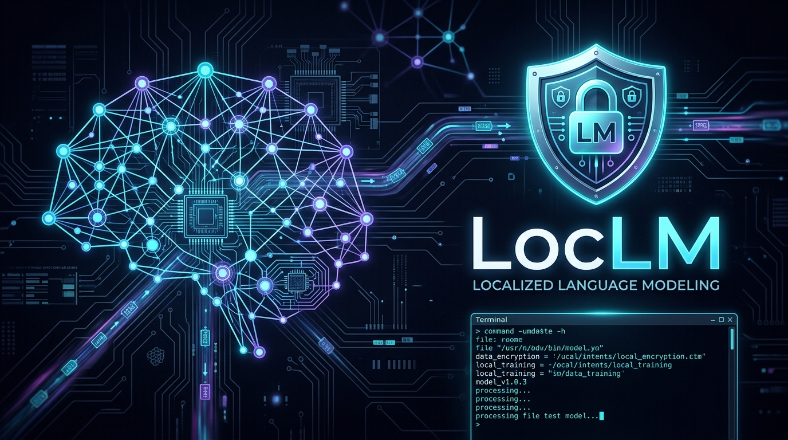
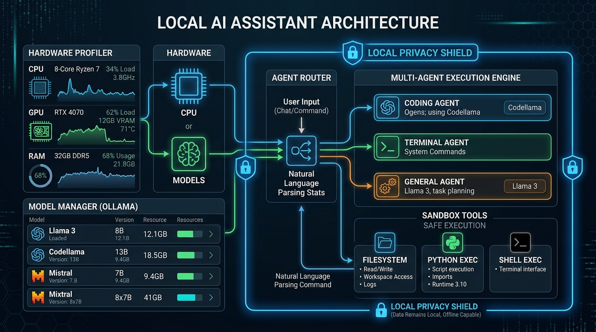
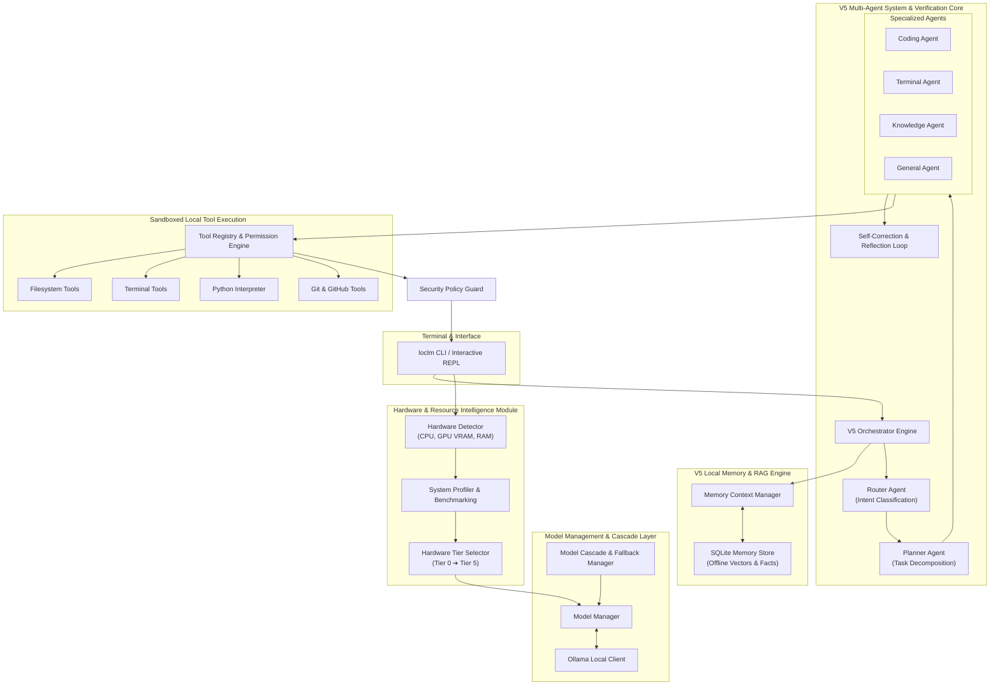

# LocLM — Universal Fully Offline Local AI Assistant

<p align="center">
  
</p>

<p align="center">
  <strong>Local Models + Local Agents + Local Tools + Local Memory = 100% Local Intelligence</strong>
</p>

<p align="center">
  <a href="#-privacy-first"></a>
  <a href="#-hardware-support"></a>
  <a href="https://python.org"></a>
  <a href="LICENSE"></a>
</p>

---

**LocLM** is a privacy-first, fully offline, terminal-native AI assistant designed to run entirely on your local machine. It dynamically inspects your system hardware (CPU, GPU, RAM, VRAM), selects appropriate quantized LLMs via local engines like [Ollama](https://ollama.ai), and orchestrates multi-agent workflows—with zero cloud dependencies, zero network data egress, and complete user sovereignty.

---

## 🔒 Privacy First Guarantee

- 🛡️ **100% Offline Operation**: Functions completely disconnected from the Internet after initial setup.
- 🚫 **Zero External Telemetry**: No tracking, metrics, analytics, or background telemetry.
- 🔑 **No Cloud APIs Required**: No reliance on OpenAI, Anthropic, Google, or any remote subscription service.
- 💻 **On-Device Inference**: All model weights execute locally on your CPU/GPU hardware.
- 🗄️ **Local Memory & Workspace Storage**: History, tool state, and context persist solely on your local storage.

---

## 📐 Architecture Overview

LocLM implements a modular **V6 Multi-Agent Architecture with Multi-Repo AST Refactoring & Regression Testing** backed by intelligent hardware profiling and sandboxed local execution tools.

<p align="center">
  
</p>

### System Architecture Flow (Mermaid Diagram)



---

## 🧩 Architectural Components

### 1. ⚙️ Hardware Profiler & Tier Engine (`loclm.hardware`)
LocLM automatically benchmarks your hardware environment on launch:
- **System Memory**: Detects available physical and virtual RAM.
- **Accelerator Detection**: Auto-detects NVIDIA CUDA GPUs, Apple Silicon Metal (unified memory), and AMD ROCm.
- **Hardware Tiers**: Automatically classifies hardware into Tiers (0 to 5) to adjust model parameters (context window size, batching, thread pool concurrency, quantization level).

### 2. 🧠 Model Management & Cascade Layer (`loclm.models`)
- Integrates with local inference backends (Ollama).
- **Model Cascade Manager**: Implements multi-tier fallback execution if model limits or memory pressure are encountered.
- Dynamic model selection based on hardware capabilities and user task requirements.

### 3. 💾 V5 Offline Local Memory (`loclm.memory`)
- **SQLite Memory Store**: Offline, zero-dependency storage for project knowledge, codebase rules, user facts, and task history.
- **Context Retrieval (RAG)**: Automatically injects relevant past memory snippets into agent context prompts.

### 4. 🤖 V5 Multi-Agent System & Self-Correction (`loclm.agents`)
- **V5 Orchestrator Engine**: Coordinates context retrieval, routing, task planning, execution, and persistent memory logging.
- **Router Agent**: Parses incoming prompt intent and dispatches tasks to dedicated specialized agents.
- **Planner Agent**: Breaks complex, multi-step queries into structured execution paths.
- **Self-Correction & Verification Loop**: Automatically reflects on tool execution errors and re-evaluates inputs to resolve failures before returning responses.
- **Specialized Agents**:
  - `CodingAgent`: Handles code analysis, refactoring, patch creation, and syntax validation.
  - `TerminalAgent`: Interprets natural language requests into shell operations with built-in safety boundaries.
  - `KnowledgeAgent`: Synthesizes project structure, documentation, and localized knowledge items.
  - `GeneralAgent`: Handles general dialogue, reasoning, and standard assistant interactions.

### 5. 🛠️ Sandboxed Tool System (`loclm.tools`)
- **Filesystem**: Safe file reading, modification, tree traversal, and diff generation within workspace boundaries.
- **Terminal Sandbox**: Executes commands with explicit permission enforcement (`READ_ONLY`, `USER_CONFIRM`, `FULL_CONTROL`).
- **Python Sandbox**: Isolated Python runtime execution for mathematical modeling and data processing.
- **Git Integration**: Inspects repository status, log histories, commit patterns, and branch status cleanly.

---

## 🖥️ Hardware Tier System

LocLM matches your hardware configuration to optimal model tiers:

| Tier | Hardware Profile | Recommended Models | Max Context |
| :--- | :--- | :--- | :--- |
| **TIER 0** | CPU + <8GB RAM | `tinyllama`, `qwen2.5:0.5b` | 2,048 tokens |
| **TIER 1** | CPU + 8–16GB RAM | `qwen2.5:1.5b`, `llama3.2:1b` | 4,096 tokens |
| **TIER 2** | GPU 4–8GB VRAM / Apple M-Series (8–16GB) | `qwen2.5:3b`, `qwen2.5:7b-q4` | 8,192 tokens |
| **TIER 3** | GPU 8–16GB VRAM / Apple M-Series (16–32GB) | `qwen2.5:7b`, `mistral:7b`, `deepseek-r1:7b` | 16,384 tokens |
| **TIER 4** | GPU 16–24GB VRAM / Apple M-Series (32–64GB) | `qwen2.5:14b`, `codellama:13b`, `mistral-nemo` | 32,768 tokens |
| **TIER 5** | GPU 24GB+ VRAM / Apple M-Series (64GB+) | `qwen2.5:32b`, `llama3.3:70b-q4` | 65,536+ tokens |

---

## 🚀 Quick Start Guide

### Prerequisites

- **Python 3.12+**
- **[Ollama](https://ollama.ai)** installed and running in the background (`ollama serve`)

### 1. Installation

Clone the repository and install LocLM in editable mode:

```bash
git clone https://github.com/ashutoshsahuuu09/LocLM.git
cd LocLM
pip install -e .
```

### 2. Pull a Local Model

Pull your preferred model via Ollama (e.g., Qwen 2.5):

```bash
ollama pull qwen2.5:3b
```

### 3. Basic Execution

```bash
# Launch interactive REPL mode
loclm

# Run a one-shot task directly from terminal
loclm "Create a Python script that formats JSON logs"

# Inspect hardware tier and status
loclm status

# Run system health diagnostics
loclm doctor
```

---

## 🛠️ CLI Command Reference

| Command | Usage | Description |
| :--- | :--- | :--- |
| `loclm` | `loclm` | Launches the interactive terminal REPL interface |
| `loclm "prompt"` | `loclm "Explain AsyncIO"` | Executes a prompt directly in one-shot mode |
| `loclm chat` | `loclm chat` | Explicit chat mode with session persistence |
| `loclm status` | `loclm status` | Displays detected hardware, VRAM, and active Tier |
| `loclm doctor` | `loclm doctor` | Validates local dependencies (Ollama, Python, SQLite) |
| `loclm models` | `loclm models` | Lists available local models and status |
| `loclm config` | `loclm config` | View and edit user configurations |
| `loclm version` | `loclm version` | Prints current LocLM version details |

---

## 📂 Project Structure

```
LocLM/
├── assets/                       # README Visual Assets & Diagrams
│   ├── loclm_hero_banner.jpg
│   └── loclm_architecture_visual.jpg
├── config/                       # Configuration schemas & default profiles
├── loclm/                        # Core LocLM Python Package
│   ├── agents/                   # Router, Planner, Loop Runner, Specialized Agents
│   ├── cli/                      # Rich/Typer Terminal Interface
│   ├── core/                     # Orchestrator & State Management
│   ├── hardware/                 # CPU/GPU Detector & Tier Profiler
│   ├── models/                   # Ollama Manager & Model Selector
│   ├── security/                 # Isolation & Network Security Guards
│   └── tools/                    # Sandboxed Tools (FS, Terminal, Python, Git)
├── tests/                        # Comprehensive Pytest Suite
├── pyproject.toml                # Project Build Configuration
└── README.md                     # Documentation
```

---

## 📄 License

Distributed under the MIT License. See [LICENSE](LICENSE) for more information.
